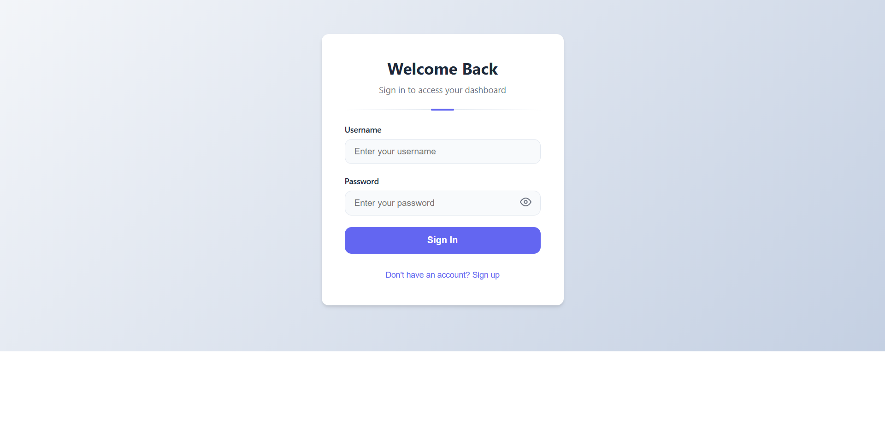
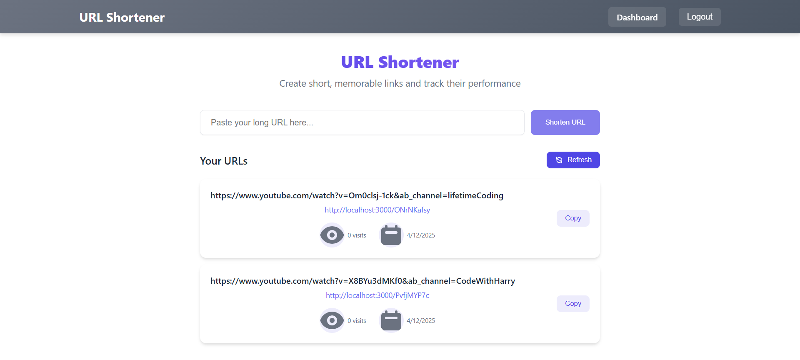

# URL Shortener Application

A full-stack URL shortening service with user authentication and analytics.

## Features
- User registration and login
- URL shortening with custom aliases
- Dashboard to view and manage shortened URLs
- Basic click analytics

## Screenshots



## Technology Stack
### Frontend
- React with TypeScript
- TailwindCSS for styling
- Axios for API calls
- React Router for navigation

### Backend
- Node.js with Express
- MongoDB for data storage
- JWT for authentication
- Express Validator for input validation

## Installation
### Backend Setup
1. Navigate to backend directory:
```bash
cd backend
```
2. Install dependencies:
```bash
npm install
```
3. Create a `.env` file with your MongoDB connection string:
```env
MONGO_URI=your_mongodb_connection_string
JWT_SECRET=your_jwt_secret_key
```
4. Start the server:
```bash
npm start
```

### Frontend Setup
1. Navigate to frontend directory:
```bash
cd frontend
```
2. Install dependencies:
```bash
npm install
```
3. Start the development server:
```bash
npm start
```

## API Endpoints
- `POST /api/auth/register` - User registration
- `POST /api/auth/login` - User login
- `POST /api/url/shorten` - Create short URL
- `GET /api/url/:shortCode` - Redirect to original URL
- `GET /api/stats/:shortCode` - Get URL statistics

## Usage
1. Register a new account or login
2. Enter a URL to shorten in the input field
3. Optionally specify a custom short code
4. View your shortened URLs in the dashboard
5. Click on any URL to view its statistics

## Deployment
To deploy this application:
1. Set up a MongoDB Atlas database
2. Configure environment variables in production
3. Build the frontend:
```bash
cd frontend
npm run build
```
4. Deploy the backend to your preferred hosting service
